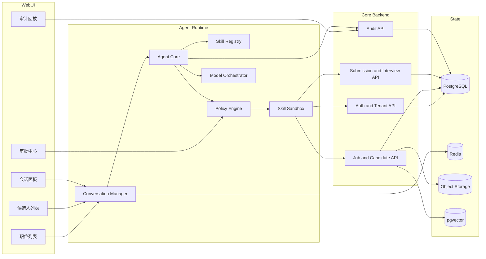
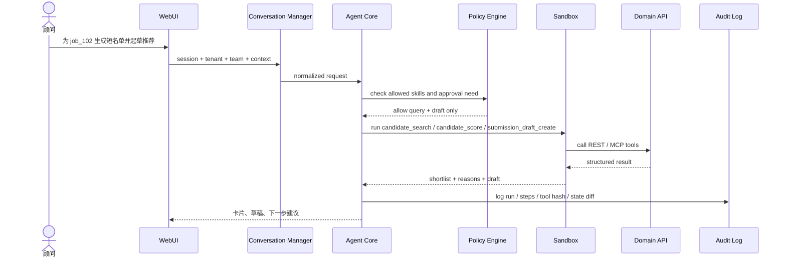

# 独立开发者将猎头 SaaS 轻量化为 agent、skills 与 WebUI 的落地指南

## 执行摘要

这条路线可行，但前提不是“把整个猎头 SaaS 改造成一个聊天机器人”，而是**保留一个很薄但很硬的业务内核，把高频、弱事务、重解释的动作做成 skill，再用 WebUI 承担会话、审批、回放与运营界面**。来自 entity["organization","OpenAI","ai company"] 的官方文档已经明确：Responses API 是新项目推荐入口；Codex 的技能体系建立在开放 agent skills 标准之上；`AGENTS.md` 会在工作前自动加载；而远程 MCP 工具可以通过 `allowed_tools` 与审批机制收窄工具面。来自 entity["organization","Anthropic","ai company"] 的 Claude Code 官方文档也说明，它支持 CLI、IDE、Web、CLAUDE.md、skills、hooks、MCP、GitHub Action、cloud routines 与 checkpoints，适合做“第二开发代理”和 CI reviewer。citeturn0search0turn0search1turn0search6turn18search0turn18search2turn5search0turn1search3turn2search1turn3search0

按面向 entity["country","中国","east asia"] 市场、独立开发者首发的现实约束来看，最优路线不是先做完整 ATS/CRM/ERP，也不是先做多渠道 IM 网关，而是先做一个**单机可跑、单租户起步、可扩展到多团队**的“猎头工作台”：职位画像、候选人导入、去重、短名单、推荐草稿、审批、审计回放六个能力先跑通，再逐步补齐排程、写操作、导出与财务 lite。这个顺序更符合中国法规的落地压力：PIPL 要求合法、正当、必要、最小范围与最短保存期；《网络数据安全管理条例》自 2025 年 1 月 1 日施行；《个人信息保护合规审计管理办法》自 2025 年 5 月 1 日施行；《生成式人工智能服务管理暂行办法》《互联网信息服务算法推荐管理规定》又把自动化决策、生成式内容与算法治理拉进了同一责任框架里。citeturn22view1turn6search1turn6search2turn6search0turn7search0

对独立开发者而言，推荐路线可以压缩成一句话：**先用 Codex/Claude Code 生成“可审计的小模块”，再把这些模块接成 agent runtime，而不是先写一个“全能 agent”再倒逼业务内核补课。** 公共产品参照也支持这个判断：entity["company","Moka","hr saas china"] 的公开招聘与猎头产品页已经把简历解析、智能筛选、查重、面试协同、保温提醒、猎头协同、流程自动化等能力呈现为标准化操作节点，这正是最适合被 skill 化的部分。citeturn14search2turn14search4turn14search5

还需要补一条非常务实的限制：若你把 Claude Code 作为开发流的一部分，官方安装前提要求所在位置属于 supported countries；在中国大陆是否能直接作为唯一核心工具依赖，应以上线时官方支持列表为准，因此**不要把 Claude Code 设计成整个项目唯一不可替代的开发基础设施**。Codex CLI 则支持 Sign in with ChatGPT 或 API key 两种路径，其中 API key 流量遵循 API 组织的数据保留设置，更适合把真实业务代码与数据控制收在同一治理面里。OpenAI 的业务数据文档还说明，API/企业业务数据默认不用于训练；Responses API 默认应用状态保留 30 天，Zero Data Retention 需要符合资格与配置；公开 data residency 区域不含中国大陆。citeturn4search1turn0search16turn17search5turn0search3turn17search0

## 首发产品与最小可交付系统

首发产品应定义为**猎头顾问工作台**，不是“全自动猎头机器人”。适合首发的，是顾问每天都会做、又能被结构化的动作：职位画像、简历导入、去重、排序、推荐草稿、排程、审批与回放；不适合首发的，是复杂结算、跨企业流程协同、公共内容发布、批量导出和高风险写操作自动执行。这个切法既符合公开招聘产品展示出的成熟能力边界，也符合 Responses/MCP 的推荐用法：模型负责看、想、草拟、解释，正式写状态由业务 API 和审批链负责。citeturn14search4turn14search5turn18search0turn18search2

**MVS 清单**

| 优先级 | 模块 / Skill | 最小范围 | 最小验收条件 | 示例 API |
|---|---|---|---|---|
| P0 | 租户与团队 lite | `tenant/team/user/role` 四对象 | 所有业务表强制带 `tenant_id`；跨租户查询为 0 | `POST /api/v1/tenants` |
| P0 | 职位与画像 | JobOrder、JobBrief、Scorecard | 可创建职位、锁定画像、保存版本 | `POST /api/v1/job-orders` |
| P0 | 候选人导入 | PDF/Word/文本上传、对象存储、解析状态 | 可上传、列表、失败重试、错误可见 | `POST /api/v1/candidates/import` |
| P0 | 去重归并 | identity hash + review queue | 自动命中可疑重复，人工确认合并 | `POST /api/v1/candidates/dedupe/review` |
| P0 | 短名单评分 | 规则版 ranker + LLM 解释层 | 输出 `score/reason_codes/gap_items` | `POST /api/v1/match-scores/run` |
| P0 | 推荐草稿 | 仅生成 draft，不改正式状态 | 草稿可编辑、可版本回看 | `POST /api/v1/submissions/draft` |
| P0 | Agent Runs | run、steps、tool calls、artifacts | 任一 skill 运行可在 UI 中查看步骤 | `GET /api/v1/runs/{id}` |
| P0 | 审批中心 | `submit/schedule/export` 走审批 | 无 token 不能执行正式写操作 | `POST /api/v1/approvals` |
| P0 | 审计回放 | 输入摘要、工具、审批、state diff | 任一正式动作可 replay | `GET /api/v1/runs/{id}/replay` |
| P0 | Query Skills | `job_brief_fetch` `candidate_search` `candidate_score` | 只读 skill 能从会话里触发 | MCP tools |
| P0 | Draft Skills | `submission_draft_create` | 默认只写 draft 表 | MCP tools |
| P1 | 协同与排程 | `interview_schedule` `reminder_tick` | 能排 mock/真实面试并回写提醒 | `POST /api/v1/interviews/schedule` |
| P1 | 写操作 Skills | `submission_submit` `export_candidates_csv` | 都要 approval token | MCP tools |
| P1 | 财务 lite | Placement、Invoice lite、回款状态 | 仅保存状态，不做复杂佣金引擎 | `PATCH /api/v1/placements/{id}` |

首发权限与多租户建议采用**共享库 + 强逻辑隔离 + 审批兜底**，不要一开始就做复杂分库。PIPL 对合法性、目的限制、最小范围、公开透明与最短保存期的要求决定了：对于独立开发者，**把权限做简单，但必须做硬**，比“权限模型很高级但首发不可用”更重要。citeturn22view1turn23search0turn24search0

**简化版角色矩阵**

| 角色 | 读权限 | 写权限 | 限制 |
|---|---|---|---|
| owner | 本租户全部 | 本租户全部 | 敏感导出仍需审批 |
| team_admin | 本团队全部 | 职位、候选人、草稿、排期 | 不能越团队访问 |
| consultant | 本团队职位、候选人、草稿、run | 创建草稿、发起审批、写跟进 | 不能正式提交/导出敏感信息 |
| researcher | 候选人基础档案、职位画像 | 导入简历、标注、发起去重 | 不能看财务、不能正式提交 |
| reviewer | 与审批相关对象 | 批准/拒绝 command | 不可自批高风险动作 |
| finance_lite | Placement/Invoice lite | 更新回款与开票状态 | 看不到无关原始简历 |

## 分阶段落地指南

分阶段路线应按“**一个阶段一个可验收闭环**”来排，而不是按“先做前端、再做后端、最后接模型”来排。Codex 的官方最佳实践强调先计划、用 `AGENTS.md` 固化约束、把重复工作沉淀为 skills；Claude Code 的文档则强调 CLAUDE.md、checkpoints、GitHub Action 与 routines 的组合。这些能力都在提醒同一件事：**独立开发者最怕的不是进度慢，而是任务粒度过大导致 AI 代理失控。**citeturn0search2turn0search6turn5search0turn2search1turn1search17

**分阶段计划（单人全职基线）**

| 阶段 | 里程碑 | 可交付物 | 验收标准 | 估时 | 关键风险 | 缓解措施 |
|---|---|---|---|---|---|---|
| 发现 / 蓝图 | 边界冻结 | PRD、ADR、ER 草图、OpenAPI stub、事件命名表、样例数据 | 首发闭环与非目标明确；`job → candidate → draft → approval → replay` 路径冻结 | 24–40 人·小时 / 1 周 | 需求发散 | 只保留 P0，P1 进入 parking lot |
| 内核实现 | 真相源可用 | tenants/teams/users/job_orders/candidates/resume_assets 基础 CRUD，RBAC lite，文件上传 | 本地可创建职位、上传候选人、列出数据 | 80–120 人·小时 / 2–3 周 | schema 反复改 | 先写 migration，再写 API，再写 UI |
| Skill MVP | Query/Draft 跑通 | match_scores、ranker v1、skill registry、query executor、draft executor、首批 skills | 能在会话里生成短名单与推荐草稿；仍不改正式状态 | 64–96 人·小时 / 1.5–2.5 周 | 排序不可解释 | 强制输出 reason codes / gap items |
| 协同与排程 | 顾问协同可用 | interview schedule mock、提醒 worker、候选人与职位详情页、shortlist 视图 | 可从 WebUI 发起排期并查看 run timeline | 40–56 人·小时 / 1–1.5 周 | 交互碎片化 | 先工作台，再聊天框 |
| 写操作与审批 | 高风险动作可控 | approvals、approval token、submission submit、command executor、replay viewer | 无 token 不得正式写入；所有正式动作可 replay | 48–72 人·小时 / 1–2 周 | 误写状态 | state diff 确认 + 幂等键 |
| 财务治理 | 最小治理闭环 | placement / invoice lite、导出审批、字段脱敏、供应商台账、模型版本表 | 可记录到岗/开票状态；批量导出需审批 | 32–48 人·小时 / 1 周 | 合规后补 | 先做最小治理，不做复杂财务 |
| 稳定化 / 多团队 | 可试点上线 | docker compose、CI、备份恢复、租户隔离测试、运维 SOP、用户手册 | 一键部署；串租户测试为 0；有回滚与备份 | 64–96 人·小时 / 2 周 | 上线后难维护 | 只支持一套标准部署脚本 |

单人全职版本，首个能演示的版本通常落在 **9–13 周、352–528 人·小时**。若按小/中/大三档协作估算，小档是 1 人全职；中档是 1 人全职 + 1 名兼职前端/测试；大档是 1 人全职 + 2 名兼职或短期外包。多人的收益主要体现在 WebUI、测试与文档，不在业务架构本身。

**每阶段收尾 Gate**

| Gate | 内容 | 通过条件 |
|---|---|---|
| 业务 Gate | 闭环是否更清晰 | 新功能没有扩张首发边界 |
| 代码 Gate | 改动是否可回滚 | migration 可回退，feature flag 可关闭 |
| 数据 Gate | schema 与样例是否同步 | OpenAPI、ER、seed 都更新 |
| 合规 Gate | 是否引入新 PII/导出路径 | 字段分级与审批策略同步更新 |
| 运营 Gate | 是否可演示、可测试 | 有脚本、有演示数据、有失败案例 |

## 瀑布式任务拆解

下面这张任务表专门按“**单次代理窗口可完成**”来设计：优先≤4 小时，最长不超过 1 个工作日。任务拆法遵循 Codex 和 Claude Code 的共同经验：限定输入、限定改动面、限定产物、限定验证方式，再把检查点和 CI 门禁写死在任务合同里。Codex 通过 `AGENTS.md` 自动加载仓库规则；Claude Code 通过 CLAUDE.md、checkpoints、hooks 和 GitHub Action 提供上下文、可恢复性和自动审查。citeturn0search6turn0search2turn2search1turn5search0turn1search3

**CI 门禁缩写**：L = lint，T = typecheck，U = unit，I = integration，M = migration check，O = openapi diff，R = replay snapshot。

| 阶段 | 模块 | 任务名 | 目标 | 输入 / 输出 | 产物 | 估时 | 检查点 / 验收条件 | CI |
|---|---|---|---|---|---|---:|---|---|
| 发现 | 仓库 | 初始化 monorepo | 建目录、包管理、基本脚本 | 输入：技术栈；输出：可启动骨架 | repo、README | 2h | `pnpm install` / `uv sync` 成功 | L/T |
| 发现 | 规范 | 写 `AGENTS.md` | 固化编码规则与禁区 | 输入：边界；输出：上下文文件 | `AGENTS.md` | 1h | 明确“只做单任务、必须带测试与回滚” | L |
| 发现 | 规范 | 写 `CLAUDE.md` | 给 Claude Code 同步规则 | 输入：同上；输出：记忆文件 | `.claude/CLAUDE.md` | 1h | 与 `AGENTS.md` 无冲突 | L |
| 发现 | 文档 | 产出 PRD v0 | 冻结首发范围 | 输入：本报告；输出：PRD | `docs/prd.md` | 2h | P0/P1 与非目标写清 | L |
| 发现 | 文档 | 产出 ADR-001 | 冻结“薄内核 + skills + WebUI”架构 | 输入：架构决策；输出：ADR | `docs/adr-001.md` | 2h | 说明为何不做 full ATS | L |
| 发现 | 契约 | 写 OpenAPI skeleton | 建最小 REST 契约 | 输入：核心对象；输出：stub | `openapi.yaml` | 3h | 至少 6 个端点可 lint | O |
| 发现 | 契约 | 写事件命名表 | 固定 topic 和 payload 名称 | 输入：流程节点；输出：事件表 | `docs/events.md` | 2h | topic 命名统一、无歧义 | L |
| 发现 | 数据 | 写 seed 与 mock | 提供演示数据 | 输入：职位/候选人样例；输出：数据脚本 | `scripts/seed.*` | 2h | 一条命令可灌库 | U |
| 内核 | DB | 初始化 migration | 建核心表迁移 | 输入：ER 草图；输出：第一版 schema | migrations | 3h | 可 `up/down`，无 drift | M |
| 内核 | 租户 | tenants/teams CRUD | 最小多租户对象 | 输入：schema；输出：接口 | routes + tests | 3h | 创建/查询/删除都通过 | U/I |
| 内核 | 用户 | users/roles API | 最小角色体系 | 输入：角色矩阵；输出：接口 | routes + tests | 3h | consultant 与 owner 权限差异生效 | U/I |
| 内核 | 职位 | job_orders CRUD | 建职位真相源 | 输入：OpenAPI；输出：接口 | routes + tests | 4h | version 自增，更新留痕 | U/I/O |
| 内核 | 候选人 | candidates CRUD | 建候选人基础对象 | 输入：schema；输出：接口 | routes + tests | 4h | 列表、详情、搜索可用 | U/I |
| 内核 | 文件 | resume_assets 上传 | 原始简历入库 | 输入：对象存储配置；输出：上传接口 | storage adapter | 3h | 上传后能取回 metadata | U/I |
| 内核 | 权限 | RBAC lite 中间件 | 强制 tenant/team scope | 输入：角色矩阵；输出：middleware | auth middleware | 3h | 越权返回 403 | U/I |
| 内核 | 解析 | parser adapter | 接 PDF/文本解析器 | 输入：样例简历；输出：标准化 parse result | service + tests | 4h | 失败有结构化错误 | U |
| 内核 | 标准化 | identity hash | 候选人身份归一 | 输入：姓名/手机号/邮箱；输出：hash | util + tests | 2h | 相同身份得相同 hash | U |
| 内核 | 去重 | dedupe review queue | 构造人工确认队列 | 输入：hash 命中；输出：review case | worker + API | 4h | 冲突能进入队列 | U/I |
| Skill MVP | 匹配 | `match_scores` service | 保存评分结果 | 输入：job/candidate；输出：score 行 | service + tests | 3h | 每条记录含模型版本 | U |
| Skill MVP | 匹配 | rule ranker v1 | 规则版排序 | 输入：must-have/nice-to-have；输出：score | ranker + tests | 4h | 硬条件不满足必须淘汰 | U |
| Skill MVP | 解释 | reason code helper | 生成解释字段 | 输入：ranker 结果；输出：reasons/gaps | helper + tests | 3h | 解释不改变排序结果 | U |
| Skill MVP | 运行时 | skill registry loader | 自动发现 `SKILL.md` | 输入：skills 目录；输出：元数据清单 | registry service | 3h | 新 skill 可自动加载 | U |
| Skill MVP | 运行时 | query executor | 只读 skill 执行器 | 输入：registry + tool client；输出：run steps | executor + tests | 4h | 只能调只读工具 | U/I/R |
| Skill MVP | 技能 | `job_brief_fetch` | 拉职位画像 | 输入：job id；输出：brief JSON | skill + tests | 1h | 返回 schema 稳定 | U |
| Skill MVP | 技能 | `candidate_search` | 搜候选人 | 输入：filters；输出：候选人列表 | skill + tests | 2h | 支持关键词 + 过滤条件 | U |
| Skill MVP | 技能 | `candidate_score` | 计算短名单 | 输入：job/candidate ids；输出：scores | skill + tests | 2h | 返回 score + reasons | U |
| Skill MVP | 技能 | `submission_draft_create` | 生成推荐草稿 | 输入：job + candidate；输出：markdown 草稿 | skill + tests | 4h | 只写 draft 表，不改正式状态 | U/I |
| 协同 | 日历 | calendar adapter | 抽象日历接口 | 输入：provider config；输出：mock/真实接口 | adapter + tests | 3h | 支持 freebusy mock | U |
| 协同 | 排程 | `interview_schedule` mock | 生成排期建议 | 输入：timeslot；输出：schedule draft | skill + tests | 4h | 无 approval token 不提交 | U/I |
| 协同 | 提醒 | reminder worker | 面试/待办提醒 | 输入：scheduled items；输出：提醒事件 | worker + tests | 3h | 到期能发事件不重复 | U/I |
| 协同 | WebUI | 职位列表页 | 工作台入口 | 输入：job API；输出：页面 | page + hooks | 3h | 可分页/搜索 | L/T/I |
| 协同 | WebUI | shortlist 卡片页 | 展示短名单与解释 | 输入：match API；输出：页面 | page + hooks | 4h | 可看 reason/gap/confidence | L/T/I |
| 写操作 | 审批 | approvals service | 发起/批准/拒绝审批 | 输入：action + diff；输出：approval token | service + tests | 4h | token 过期/拒绝生效 | U/I |
| 写操作 | 状态 | `submission_submit` endpoint | 正式提交推荐 | 输入：submission id + token；输出：状态变更 | endpoint + tests | 3h | 无 token 403；幂等可重试 | U/I |
| 写操作 | 运行时 | command executor | command skill 执行器 | 输入：approval token；输出：state diff | executor + tests | 4h | 所有写动作落 replay | U/I/R |
| 写操作 | 回放 | audit logger | 记录 run/step/tool/diff | 输入：runtime events；输出：audit_logs | service + tests | 3h | 任一正式动作有完整日志 | U/R |
| 写操作 | WebUI | 审批中心页 | UI 处理高风险动作 | 输入：approvals API；输出：页面 | page + hooks | 3h | 可批准/拒绝并看 diff | L/T/I |
| 财务治理 | 财务 | placement/invoice lite | 最小成交与回款状态 | 输入：placement/invoice schema；输出：接口 | routes + tests | 4h | 仅做状态流，不算复杂佣金 | U/I |
| 财务治理 | 导出 | export approval + masking | 批量导出可控 | 输入：export request；输出：审批 + 脱敏文件 | service + tests | 4h | 默认脱敏；审批后可下载 | U/I |
| 财务治理 | 治理 | vendor/model ledger | 供应商与模型台账 | 输入：供应商清单；输出：表与页面 | crud + page | 3h | 可记录模型版本与用途 | U/I |
| 稳定化 | 部署 | docker compose | 单机一键拉起 | 输入：服务清单；输出：compose | compose + env | 3h | 新机器可 30 分钟内拉起 | I |
| 稳定化 | CI | GitHub Actions | 门禁流水线 | 输入：命令清单；输出：CI 文件 | workflow yaml | 3h | PR 不过门禁不可合并 | L/T/U/M/O/R |
| 稳定化 | 备份 | backup/restore 脚本 | 最小恢复能力 | 输入：PG + object store；输出：脚本 | shell + docs | 4h | 备份可恢复到演示环境 | I |
| 稳定化 | 安全 | 租户隔离 smoke tests | 防止串租户 | 输入：多租户样例；输出：测试 | integration tests | 4h | 串租户测试为 0 | I |
| 稳定化 | 文档 | 用户手册与运维 SOP | 可交付文档 | 输入：系统现状；输出：文档 | `user-manual` `ops-sop` | 4h | 新人 1 小时完成首测 | L |
| 稳定化 | 复盘 | 试点复盘模板 | 固化反馈 | 输入：问题单模式；输出：模板 | `postmortem.md` | 2h | 包含问题、根因、修复、Owner | L |

## 数据模型、API 契约与轻量运行时

REST、Events 与 MCP 三层契约要同时存在。原因不是“架构好看”，而是 OpenAI 的官方能力正好支持这种分层：Responses API 原生支持工具调用与流式语义事件；Conversation/Responses 可以承载对话上下文；远程 MCP 可以把模型接到你自己的工具面上；同时官方又明确建议缩小 `allowed_tools`，把需要 side effects 的工具放到审批下，并记录发送给 MCP 的数据。对于独立开发者，这恰好意味着：**业务真相走 REST，异步联动走 Events，模型可见面走 MCP。**citeturn18search0turn18search2turn18search4turn0search13turn0search20turn0search10

**核心表字段示例**

| 表 | 关键字段示例 |
|---|---|
| `tenants` | `id, name, status, data_region, created_at` |
| `teams` | `id, tenant_id, name, owner_user_id, created_at` |
| `users` | `id, tenant_id, team_id, email, role, status, last_login_at` |
| `job_orders` | `id, tenant_id, team_id, title, client_name, location, salary_min, salary_max, must_have_json, nice_to_have_json, status, version, created_by` |
| `candidates` | `id, tenant_id, full_name, phone_encrypted, email_encrypted, city, current_company, current_title, resume_summary, normalized_identity_hash, source_type, consent_basis, created_at` |
| `resume_assets` | `id, tenant_id, candidate_id, object_key, source_platform, parse_status, parse_confidence, uploaded_by, created_at` |
| `match_scores` | `id, tenant_id, job_order_id, candidate_id, score, confidence, reason_codes_json, gap_items_json, model_name, model_version, created_at` |
| `submissions` | `id, tenant_id, job_order_id, candidate_id, draft_markdown, status, approved_by, approval_id, submitted_at, version` |
| `agent_runs` | `id, tenant_id, session_id, actor_user_id, goal, status, selected_skills_json, model_name, model_version, started_at, ended_at` |
| `audit_logs` | `id, tenant_id, run_id, event_type, resource_type, resource_id, approval_id, tool_args_hash, state_diff_json, created_at` |

**REST 端点示例**

| 方法 | 路径 | 作用 | 最小请求体 / 查询 | 最小响应 |
|---|---|---|---|---|
| `POST` | `/api/v1/tenants` | 创建租户 | `name` | `tenant_id` |
| `POST` | `/api/v1/job-orders` | 创建职位 | `title, client_name, must_have_json` | `job_order_id, version` |
| `POST` | `/api/v1/candidates/import` | 导入简历 | `file, source_type, consent_basis` | `candidate_id, parse_status` |
| `POST` | `/api/v1/candidates/dedupe/review` | 处理疑似重复 | `case_id, decision` | `merged_candidate_id` |
| `POST` | `/api/v1/match-scores/run` | 计算短名单 | `job_order_id, candidate_ids[]` | `run_id, top_candidates[]` |
| `POST` | `/api/v1/submissions/draft` | 生成推荐草稿 | `job_order_id, candidate_id` | `submission_id, draft_markdown` |
| `POST` | `/api/v1/approvals` | 发起审批 | `action, resource_type, resource_id, diff` | `approval_id, status` |
| `GET` | `/api/v1/runs/{id}/replay` | 查看回放 | path param | `steps, tool_calls, artifacts` |

下面这个写法可以直接作为 OpenAPI 风格的首发模板。

```yaml
paths:
  /api/v1/submissions/draft:
    post:
      summary: 生成推荐草稿
      requestBody:
        required: true
        content:
          application/json:
            schema:
              type: object
              required: [job_order_id, candidate_id]
              properties:
                job_order_id:
                  type: string
                candidate_id:
                  type: string
                include_gap_analysis:
                  type: boolean
      responses:
        "200":
          description: draft created
```

```json
POST /api/v1/submissions/draft
{
  "job_order_id": "job_102",
  "candidate_id": "cand_884",
  "include_gap_analysis": true
}
```

```json
200 OK
{
  "submission_id": "sub_20260419_001",
  "status": "draft",
  "draft_markdown": "亮点...\n风险...\n建议推进理由..."
}
```

**Events 示例**

| Topic | 触发时机 | 消费者 |
|---|---|---|
| `candidate.imported` | 简历导入完成 | parser worker, dedupe worker |
| `candidate.deduped` | 去重确认完成 | shortlist worker |
| `match.scored` | 短名单生成完成 | WebUI, report worker |
| `submission.drafted` | 推荐草稿生成完成 | approval center |
| `approval.requested` | 待审批 | reviewer notifier |
| `interview.scheduled` | 面试排期完成 | reminder worker |
| `audit.logged` | 正式动作记录完成 | replay indexer |

```json
{
  "topic": "match.scored",
  "tenant_id": "t_01",
  "resource_id": "job_102",
  "payload": {
    "top_candidates": ["cand_884", "cand_221", "cand_119"],
    "model_version": "ranker_2026_04_19"
  }
}
```

**MCP 工具面示例**

| Tool | 类型 | 默认开放 | 说明 |
|---|---|---|---|
| `job_brief_fetch` | read | 是 | 拉取职位画像 |
| `candidate_search` | read | 是 | 搜索候选人 |
| `candidate_score` | read | 是 | 生成 score 与 reasons |
| `submission_draft_create` | draft-write | 是 | 只写草稿 |
| `submission_submit` | write | 否 | 需 approval token |
| `interview_schedule` | write | 否 | 需 approval token |
| `export_candidates_csv` | export | 否 | 需 approval token |

```json
{
  "type": "mcp",
  "server_label": "headhunt-core",
  "server_url": "https://app.example.com/mcp",
  "allowed_tools": [
    "job_brief_fetch",
    "candidate_search",
    "candidate_score",
    "submission_draft_create"
  ],
  "require_approval": "always"
}
```

轻量 agent runtime 的核心不是“更聪明的 agent”，而是**更可控的 skill 调度**。它至少要包含 8 个部件：

| 部件 | 最小实现要点 | Done-when |
|---|---|---|
| Agent Core | 负责 plan、选 skill、汇总结果 | 能串起 query 与 draft 两类 skill |
| Skill Registry | 读取 `SKILL.md`、版本、依赖、owner | 新增 skill 后无需改 runtime 代码 |
| Skill Sandbox | Docker 执行器、白名单环境变量、网络开关 | 本机 shell 不直接暴露给生产 |
| Conversation Manager | session、tenant/team scope、上下文压缩 | 同一职位会话可连续运行 |
| State Persistence | PostgreSQL 业务真相、Redis 会话缓存、对象存储 artifact | run、step、artifact 都可回看 |
| Model Orchestrator | 结构化输出、重试、fallback、token 记录 | 异常可降级到规则层 |
| Approval Token | 高风险 action 的短时授权 | 无 token 无法写正式状态 |
| Audit Replay | 记录 run、工具、审批、state diff、artifact hash | 任一正式动作可 replay |





**部署建议与资源估算**

| 档位 | 形态 | 推荐资源 | 适用阶段 |
|---|---|---|---|
| 小 | 单机 `docker compose` | 4 vCPU / 8 GB RAM / 100 GB SSD | 内测、首个试点 |
| 中 | 云上单区 + 托管 PG | App 4–8 vCPU / 16 GB RAM；托管 PG 2–4 vCPU | 小规模付费试点 |
| 大 | 混合部署 | 境内真相源 + 可替换模型网关 + 独立对象存储 | 涉及跨境与较严客户要求 |

如果真实业务数据要进入外部模型，必须额外评估数据保留与驻留。OpenAI 官方说明：API/企业业务数据默认不用于训练；Responses API 默认应用状态保存 30 天；Zero Data Retention 需要资格与配置；公开 data residency 区域不含中国大陆。Claude Code 的 cloud routines 则运行在 Anthropic 管理的云基础设施上，且例行任务运行中没有审批弹窗，因此它更适合自动化开发任务，不适合未经外部 guardrail 的生产业务写操作。citeturn17search5turn0search3turn17search0turn3search0

## Codex 与 Claude Code 操作手册

最稳妥的使用方式是“**Codex 做实现，Claude Code 做审查**”。Codex 适合在 `AGENTS.md` 规则下完成单一模块、单一行为变更、脚手架和测试；Claude Code 更适合做仓库理解、跨文件审查、回归测试补齐、PR 自动评论与问题分诊。Codex 的官方文档强调计划先行、`AGENTS.md`、skills、plugins 与配置分层；Claude Code 官方文档强调 CLAUDE.md、自动记忆、hooks、checkpoints、GitHub Action 和 routines。两者叠加后，独立开发者可以做到：**一个人写需求，两个代理一个实现、一个复核，CI 负责兜底。**citeturn0search2turn0search6turn0search1turn5search0turn2search1turn1search3turn3search0

**推荐工作流**

| 步骤 | 主要工具 | 做什么 | 产物 |
|---|---|---|---|
| 任务立项 | 人工 | 把任务压缩到 ≤4 小时 | task brief |
| 实现 | Codex | 只做一个行为变化 + 测试 + 文档 | code diff |
| 审查 | Claude Code | 检查边界、测试、风险、回滚 | review note |
| 门禁 | CI | lint/typecheck/test/migration/openapi/replay | pass/fail |
| 合并 | 人工 | 看 diff、风险、回放影响 | merge |
| 复盘 | 人工 + Claude Code | 写问题单和修复建议 | postmortem |

如果你用 Codex CLI，建议走 API key 路径而不是个人工作区默认登录路径，这样 retention 与数据分享设置更可控；官方也说明，Sign in with ChatGPT 时遵循 ChatGPT 工作区的权限、RBAC 与保留/驻留设置，而 API key 路径遵循 API 组织的数据设置。Claude Code 则应当只作为“可替换的开发代理”，因为官方安装说明要求设备位于 supported countries。citeturn0search16turn4search1

**实现型 Prompt 模板**

```text
任务名：实现 /api/v1/match-scores/run 端点

目标：
- 新增端点
- 调用 ranker v1
- 保存 match_scores
- 增加单元测试与 OpenAPI 变更

约束：
- 仅修改 api/match-scores 和 openapi.yaml
- 不引入新依赖
- 不修改前端
- 所有失败返回沿用现有 error schema

输入：
- docs/prd.md
- openapi.yaml
- apps/api/src/match-scores/*
- tests/fixtures/jobs/*
- tests/fixtures/candidates/*

完成标准：
- `pnpm test match-scores` 通过
- OpenAPI diff 清晰
- 输出变更文件清单、风险点、回滚步骤
```

**审查型 Prompt 模板**

```text
请审查这次改动是否存在以下问题：
1. 没有 tenant/team scope
2. 没有写入 model_version
3. API 错误码不一致
4. 测试缺少空列表、重复 candidate、无 must-have 三类边界

只输出：
- 问题列表
- 最小修复计划
- 必补测试清单
先不要直接改代码，除非我回复“开始修复”。
```

**测试型 Prompt 模板**

```text
为 submission_draft_create 增加最小回归测试集：
- 正常生成草稿
- 职位不存在
- 候选人不存在
- tenant 不匹配
- include_gap_analysis=false
- draft 重复生成时 version 正确
输出：
- 测试文件
- 夹具文件
- 覆盖的边界说明
```

**文档型 Prompt 模板**

```text
为 approvals service 写一页开发文档，包含：
- 状态流转图
- approval token 生命周期
- 安全边界
- 常见失败模式
- 回滚步骤
只修改 docs/approval-service.md
```

**示例输出片段**

```text
计划
1. 新增 route 与 DTO
2. 接 ranker service
3. 落库 match_scores
4. 更新 openapi.yaml
5. 补 5 个单测

变更文件
- apps/api/src/match-scores/routes.ts
- apps/api/src/match-scores/service.ts
- apps/api/tests/match-scores.spec.ts
- openapi.yaml

风险
- 旧数据没有 model_version
- 空 candidate_ids 需要显式返回 400

回滚
- revert migration（若有）
- 下线 feature flag MATCH_SCORE_RUN_V1
```

**CI 门禁建议**

| 门禁 | 命令 | 意义 |
|---|---|---|
| lint | `pnpm lint` | 风格与低级错误 |
| typecheck | `pnpm typecheck` | 类型安全 |
| unit | `pnpm test` | 行为可验证 |
| migration check | `pnpm db:migrate:check` | schema 无漂移 |
| openapi diff | `pnpm openapi:diff` | 接口变更可见 |
| replay snapshot | `pnpm test:replay` | 审计结构不回退 |
| secret scan | `gitleaks detect` | 防止密钥提交 |

如果你要把代理结果接进 GitHub，Claude Code 官方已经提供了 GitHub Action，并支持 Direct Anthropic API、Amazon Bedrock、Google Vertex AI、Microsoft Foundry 等认证路径；配置文档还支持限制对话轮数来控制成本和时长。Codex 侧则更适合本地或云端完成实现，再把 PR 交给 CI 和第二代理审查。citeturn1search3turn1search17turn1search19turn0search15

```yaml
name: ci
on: [pull_request]
jobs:
  verify:
    runs-on: ubuntu-latest
    steps:
      - uses: actions/checkout@v4
      - run: pnpm install
      - run: pnpm lint
      - run: pnpm typecheck
      - run: pnpm test
      - run: pnpm db:migrate:check
      - run: pnpm openapi:diff
      - run: pnpm test:replay
```

## 数据获取、合规、风险与后续行动

关于猎聘、脉脉、BOSS 这类平台的候选人数据获取，首发策略应当明确写成：**合规导入优先，自动规避防护不做产品依赖。** 公开协议已经足够说明风险边界：BOSS 的公开协议把“蜘蛛、爬虫、拟人程序、避开/破坏技术措施等非正常浏览”明确纳入非法获取；猎聘 2024 版用户协议同样禁止通过程序、非正常浏览、蜘蛛、爬虫、拟人程序、避开/破坏技术措施等方式读取、复制、转存、获得平台数据，并且禁止将平台内获取的信息或简历用于服务目的之外的其他目的；《网络数据安全管理条例》第三十九条又明确“任何个人、组织不得提供专门用于破坏、避开技术措施的程序、工具等”。citeturn15search1turn11view0turn21view1

按 PIPL 的基本原则，候选人数据处理至少要满足合法、正当、必要、明确目的、最小范围、公开透明与最短保存期；对自动化决策，个人有说明权与拒绝仅自动化决定的权利；对敏感个人信息则需要更严格处理。对独立开发者来说，这意味着：**如果候选人来源不是用户自己上传、企业自有 ATS/邮箱导入、明确授权的合作数据源，默认都当高风险处理。**citeturn22view1turn23search0turn24search0

**可接受的数据来源与优先级**

| 优先级 | 来源 | 建议做法 | 风险级别 | 缓解措施 |
|---|---|---|---|---|
| A | 用户手工上传简历 | 必做 | 低 | 记录来源、时间、上传人 |
| A | 企业历史 ATS/CRM 导出 | CSV/Excel importer | 中 | 去重、字段映射、脱敏导入 |
| A | 招聘邮箱投递 | 解析自有邮箱附件 | 中 | 仅处理企业自有邮箱收到的数据 |
| A | 候选人自填表单 / Landing page | 表单 + 同意说明 | 低 | 留存同意与处理目的 |
| B | 内推表单 | 记录推荐关系与授权链 | 中 | 默认不公开给无关团队 |
| B | 合作猎头批量 CSV | 导入时标注来源与合同关系 | 中 | 单独数据处理协议 |
| B | 用户触发的浏览器扩展摘录 | 只提取当前可见字段到本地草稿 | 中 | 不批量、不轮询、不隐藏抓取 |
| C | 公开职位页 research | 只做行业 mapping，不取个人信息 | 低 | 仅存公司/职位公开信息 |
| D | 登录后自动批量抓取候选人数据 | 不作为产品能力 | 高 | 放弃 |

**不提供的 RAP / 规避性实现**

| 类别 | 示例 | 本报告结论 |
|---|---|---|
| 代理池 / IP 轮换 | 为规避封禁批量切换出口 | 不提供实现 |
| 反指纹 / stealth automation | 浏览器指纹伪装、环境伪装 | 不提供实现 |
| 模拟人类行为规避 | 鼠标轨迹、速率抖动、会话伪装 | 不提供实现 |
| 验证码绕过 | OCR/打码平台/短信链路绕过 | 不提供实现 |
| 账号池 / 代登录 | 多账号轮换、共享账号、代运营抓取 | 不提供实现 |
| 绕过技术措施 | 逆向、协议重放、hook 等 | 不提供实现 |

替代路线应该是半自动与授权化，而不是 stealth 抓取。BOSS、猎聘的公开条款和《网络数据安全管理条例》已经足以说明，为规避技术措施提供程序、工具或技术支持本身就是高风险。脉脉公开隐私政策搜索结果也显示其处理 IMEI、IMSI/IDFA、AndroidID、OAID 等设备标识，这进一步说明平台侧会综合设备与行为特征进行治理。citeturn15search1turn11view0turn21view1turn8search1

**半自动替代方案**

| 方案 | 适用场景 | 做法 | 风险 |
|---|---|---|---|
| 浏览器扩展用户触发 | 顾问自己浏览时顺手入库 | 用户点击“导入当前页摘要” | 中 |
| 邮箱导入 | 已投递简历处理 | 读取企业自有邮箱附件 | 中 |
| CSV 导入 | 历史人才库迁移 | 模板化导入 + 去重 | 中 |
| 合作数据源 / 付费 API | 有授权链的第三方来源 | 合同 + DPA + 字段白名单 | 中 |
| 手工录入 + OCR | 少量高价值候选人 | 人工核对后入库 | 低 |

**最小合规与审计清单**

| 控制项 | 最小措施 | 验收条件 |
|---|---|---|
| 字段分级 | `public / business / pii / sensitive_pii` 四级 | 所有表字段都有等级 |
| 脱敏 | UI 默认脱敏手机号、邮箱、证件号 | consultant 看不到完整 PII |
| 来源台账 | 记录 `source_type/source_detail/consent_basis` | 任一候选人可追溯来源 |
| 审批链 | `submit/schedule/export/share` 一律审批 | 无 approval token 不能执行 |
| 跨境控制 | 原始简历默认不外发；外发前脱敏/摘要 | 模型调用日志中不含原始 PII |
| 自动化解释 | 排序输出 `reason_codes/gap_items` | UI 可展示原因 |
| 日志与回放 | run、tool hash、approval、state diff、artifact | 正式动作可 replay |
| 模型治理 | 记录 `model_name/model_version/prompt_version` | 结果可追溯到模型版本 |
| 保留与删除 | 删除工单 + 最短保存期 | 候选人删除请求可执行 |
| 供应商台账 | 模型/OCR/短信/邮件/存储全登记 | 上线前有 vendor list |
| 合规审计 | 每周人工巡检导出、审批、异常 run | 有审计记录与处置结果 |

PIPL 第 13、17、19、24、28 条与《个人信息保护合规审计管理办法》共同决定了这些最小措施并非“锦上添花”，而是独立开发者上线前的最低工程控制面；未来如果对外提供更广泛生成式能力，还要单独评估《生成式人工智能服务管理暂行办法》与备案/登记要求。citeturn22view1turn23search0turn24search0turn6search2turn6search0turn6search8

**风险清单与缓解**

| 风险 | 表现 | 缓解 |
|---|---|---|
| 技术风险 | schema 变更多、代理输出失控 | 任务缩小、先契约后实现、CI 门禁 |
| 合规风险 | 数据来源不清、用途漂移 | 来源台账、同意记录、导出审批 |
| 运营风险 | 产品像聊天 demo 而不是工具 | 先做列表、详情、草稿、回放，不只做 chat |
| 数据质量风险 | 解析错读、误合并 | 置信度字段、人工 review queue、回退工具 |
| 模型偏见 | 排序偏向特定背景 | 规则优先、解释字段、人工 override |
| 跨境风险 | 原始简历流向境外模型 | 境内真相源、摘要出境、需法务确认 |
| 工具滥权 | skill 能直接改正式状态 | `allowed_tools` + approval token |
| RAP 被封风险 | 账号/IP/设备被风控，甚至投诉 | 首版不依赖 stealth crawl |
| 运维风险 | 单机故障与备份缺失 | 自动备份、恢复演练、对象存储版本化 |
| 供应链风险 | 代理引入高危依赖或泄漏密钥 | secret scan、依赖审计、PR review |

**交付物清单**

| 类别 | 必备交付物 |
|---|---|
| 代码 | 单仓库源码、migrations、seed、skills 目录 |
| 接口 | OpenAPI、events 文档、MCP tools 文档 |
| 部署 | `docker-compose.yml`、`.env.example`、初始化脚本 |
| 测试 | 单测、集成测试、replay snapshot、越权测试 |
| 文档 | PRD、ADR、用户手册、运维 SOP、合规清单 |
| 运营 | 演示数据、试点脚本、FAQ |
| 复盘 | 里程碑复盘模板、事故复盘模板、客户反馈模板 |

**30 / 60 / 90 天行动计划**

| 时间 | 优先级 | 行动 |
|---|---|---|
| 30 天 | P0 | 冻结 PRD/ADR/OpenAPI/ER；完成 tenants/users/job_orders/candidates/resume_assets；做出导入、去重、短名单后端 |
| 60 天 | P0 | 完成 skill registry、query/draft executor、submission draft、WebUI 职位/候选人/shortlist/run timeline；接上审批中心 |
| 90 天 | P1 | 完成提交与导出审批、审计回放、placement/invoice lite、docker compose、CI、用户手册；开始单客户试点 |

最后的结论非常明确：**独立开发者完全可以把猎头 SaaS 轻量化为 agent + skills + WebUI，但成功的关键不是“更强的模型”，而是“更小的任务、更硬的内核、更窄的工具面、更完整的审批与回放”。** 若按优先级排下一步，只做四件事就够：先冻结数据契约；再做可跑的单机真相源；然后补齐短名单与推荐草稿；最后才把写操作接进审批与审计。这样你在 9–13 周内就能拿到一个可演示、可测试、可试点的首发系统。citeturn0search2turn18search0turn0search10turn17search5

**关键参考来源**

| 主题 | 来源 |
|---|---|
| Responses API 与新项目推荐 | OpenAI Developers：Migrate to the Responses API citeturn0search0 |
| Codex skills / AGENTS / best practices | OpenAI Developers：Codex skills、AGENTS.md、Best practices citeturn0search1turn0search6turn0search2 |
| OpenAI 数据保留与企业隐私 | OpenAI Developers / OpenAI：Your data、Business data、Enterprise privacy citeturn0search3turn17search0turn17search5 |
| MCP 工具面与审批 | OpenAI Developers：MCP and Connectors、MCP docs、approval reference citeturn18search0turn18search2turn18search8 |
| Claude Code 官方能力 | Anthropic Docs：Claude Code 概述、Advanced setup、Checkpointing、Routines、Claude Code Action citeturn5search0turn4search1turn2search1turn3search0turn1search3 |
| 招聘 / 猎头产品参照 | Moka 官方：猎头管理系统、互联网解决方案、AI 招聘能力 citeturn14search2turn14search4turn14search5 |
| 中国个人信息与数据安全法规 | PIPL、网络数据安全管理条例、个人信息保护合规审计管理办法、生成式 AI 办法、算法推荐规定 citeturn22view1turn23search0turn24search0turn6search1turn6search2turn6search0turn7search0 |
| 平台抓取边界 | BOSS 公开协议、猎聘 2024 用户协议、脉脉隐私政策片段 citeturn15search1turn11view0turn8search1 |