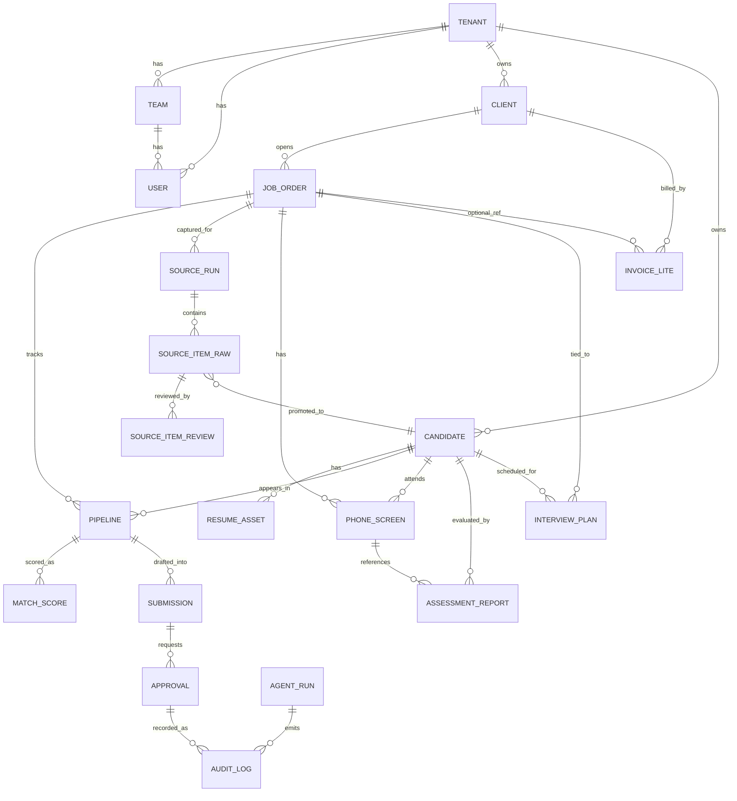

# HuntFlow Core ER

## Scope

本文件定义主线闭环、审批审计、实验轨、Phase 6 的核心实体关系与关键字段，作为模板级数据口径。

## Relationship Overview

## Core Entities and Key Fields

| Entity | Purpose | Key Fields |
|---|---|---|
| `tenants` | 租户边界 | `id`, `name`, `status` |
| `teams` | 团队组织 | `id`, `tenant_id`, `name`, `owner_user_id` |
| `users` | 用户与角色 | `id`, `tenant_id`, `team_id`, `email`, `role` |
| `auth_sessions` | 会话鉴权 | `id`, `user_id`, `status`, `issued_at`, `expires_at` |
| `clients` | 客户主数据 | `id`, `tenant_id`, `team_id`, `owner_id`, `name`, `industry`, `stage` |
| `job_orders` | 职位需求 | `id`, `tenant_id`, `client_id`, `owner_id`, `title`, `status`, `must_have`, `nice_to_have` |
| `candidates` | 候选人主数据 | `id`, `tenant_id`, `team_id`, `owner_id`, `full_name`, `email_sealed`, `phone_sealed`, `source_type`, `normalized_identity_hash` |
| `resume_assets` | 简历资产 | `id`, `tenant_id`, `candidate_id`, `file_name`, `parse_status` |
| `pipelines` | 岗位-候选人流程位 | `id`, `tenant_id`, `job_order_id`, `candidate_id`, `owner_id`, `stage`, `list_type` |
| `match_scores` | 匹配评分 | `id`, `tenant_id`, `job_order_id`, `candidate_id`, `pipeline_id`, `score`, `confidence`, `reason_codes`, `gap_items`, `model_version` |
| `submissions` | 推荐报告草稿/正式状态 | `id`, `tenant_id`, `job_order_id`, `candidate_id`, `pipeline_id`, `status`, `draft_markdown`, `version`, `model_version` |
| `approvals` | 正式写操作审批 | `id`, `tenant_id`, `run_id`, `action`, `resource_type`, `resource_id`, `state_diff`, `token`, `token_expires_at`, `status`, `requested_by`, `reviewed_by` |
| `agent_runs` | Agent 执行记录 | `id`, `tenant_id`, `actor_user_id`, `goal`, `status`, `selected_skills`, `steps`, `model_version` |
| `audit_logs` | 审计日志 | `id`, `tenant_id`, `run_id`, `event_type`, `resource_type`, `resource_id`, `actor_user_id`, `state_diff`, `metadata` |
| `automation_events` | 异步事件队列 | `id`, `tenant_id`, `type`, `entity_id`, `status`, `payload` |
| `source_runs` | 实验轨采集批次 | `id`, `tenant_id`, `job_order_id`, `source_name`, `status`, `source_config`, `created_by` |
| `source_items` | 实验轨原始条目 | `id`, `tenant_id`, `source_run_id`, `job_order_id`, `raw_payload`, `normalized_draft`, `review_status`, `promoted_candidate_id` |
| `source_reviews` | 实验轨审核记录 | `id`, `tenant_id`, `source_item_id`, `decision`, `reviewer_id`, `note` |
| `phone_screens` | Phase 6 电话初筛 | `id`, `tenant_id`, `job_order_id`, `candidate_id`, `owner_id`, `scheduled_at`, `status`, `call_summary`, `recommendation` |
| `assessment_reports` | Phase 6 评估报告 | `id`, `tenant_id`, `job_order_id`, `candidate_id`, `phone_screen_id`, `created_by`, `status`, `score_snapshot`, `strengths`, `risks` |
| `interview_plans` | Phase 6 面试计划 | `id`, `tenant_id`, `job_order_id`, `candidate_id`, `coordinator_id`, `interviewer_name`, `stage`, `scheduled_at`, `status` |
| `invoices` | Phase 6 发票轻量记录 | `id`, `tenant_id`, `client_id`, `job_order_id`, `owner_id`, `amount`, `currency`, `due_date`, `status` |

## State Boundaries

| Boundary | Rule |
|---|---|
| Tenant Isolation | 所有业务实体必须带 `tenant_id` 并按租户过滤读取。 |
| Mainline Write Gate | `submissions` 正式状态变更必须经过 `approvals`。 |
| Approval Token | `approvals.token` 与 `token_expires_at` 约束正式动作有效期。 |
| Audit Visibility | 正式动作需在 `audit_logs` 可追溯，且可通过 `run_id` 回放。 |
| Experimental Promotion Gate | `source_items.review_status=APPROVED` 才可晋升候选人。 |
| Phase 6 Traceability | `phone_screens`/`assessment_reports`/`interview_plans`/`invoices` 需写入审计事件。 |
